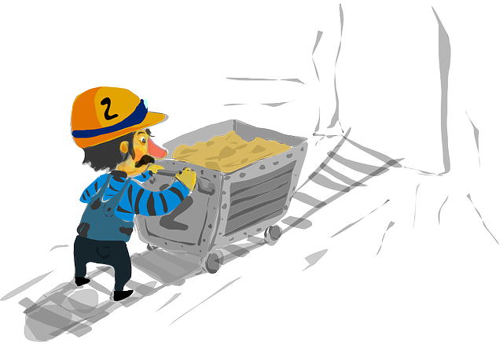
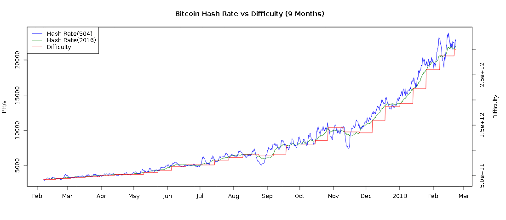

<!-- $theme: gaia -->
<!-- footer: Sobtec 2018 -->
<!-- page_number: true -->
<!-- $size: 4:3 -->
<!-- template: invert -->

# 

## Desmitificant BlockChain

==Abel - <vdo@greyfaze.net> PGP:4EE1184B ==
==Pau - <p4u@dabax.net> PGP:5CF989CD ==

---

# 1. Context històric
---

## Història
* **Cypherpunk** (finals dels 80)
* Criptografia **asimétrica**
(Phil Zimmermann, PGP, 1991)
* **Proof of Work** d'Adam Back (e-mail)
* Xarxes **p2p** (e-Donkey, DHT, Torrent, etc...)
* Nick Szabo, Hal Finney, Dai Wei, etc.
* Satoshi Nakamoto (**Blockchain**)

---

 _... We the Cypherpunks are dedicated to building anonymous systems. We are defending our privacy with cryptography, with anonymous mail forwarding systems, with digital signatures, and with electronic money._ 

Eric Hughes - Cypherpunk manifesto, 1993

---

# (Portada Times)
->> The Times 03/Jan/2009 Chancellor on brink of second bailout for banks.

---

# 2. Blockchain

---

## BlockChain (definició)

* Base de dades distribuïda
* Ordenada i inmutable
* Verificada mitjançant criptografia
* Velocitat de creixement control·lada i estipulada

---

## Blockchain [blocs i miners]

* Informació classificada en _blocs_
* Només els _miners_ poden crear blocs
* BitCoin: 1 bloc = 1 MByte (max)

---

## Blockchain [creixement]

* creixement control·lat amb problema matemàtic
* dificultat proporcional al poder de còmput global
* cada N blocs es recalcula la dificultat
* BitCoin: _1 bloc cada 10 Minuts_

---

### Dificultat i hashrate ultims 9 mesos

---

## Blockchain [recompensa]
* per incentivar la mineria hi ha una **recompensa**
* en el BitCoin inicialment 50 BTC
* cada 4 anys es redueix a la meitat (210k blocs)

---

## Resum

---

## Blockchain [rel.levancia]

* **base de dades disitribuïda** on els actors no necessiten ser de confiança
* **registre inmutable** i ordenat de dades amb marca de temps (timestamp)
* Dissenyada per a evitar centralització i/o censura.

**Exemples:** Sistema monetari, notaria, vot electrònic, Crowdfundings, etc...

_A més  a més plataformes com Ethereum permeten l'execució de programes en el blockchain._

---

# 3. Desmitificant BitCoin

---
## Ús i abús de la blockchain

* Nova 'criptoeconomia' no regulada
* Especulació
* Hiper-tokenització
* (Re)Valorització independent de la seva utilitat real

---
## Exemples recents

- Veneçuela, Iran, Canon, Nostrum, Facebook, Telegram
---

## Privacitat

- Bitcoin i la majoria de blockchains son pseudónimes i totalment _transparents._

---
## Energia
- Dades 2017
- Comparativa amb països

---
## Energia

- Canvi de Proof-of-Work a Proof-of-Stake (?)
	- Seguretat no probada.
	- Incentiva l'acumulació de capital. 	
