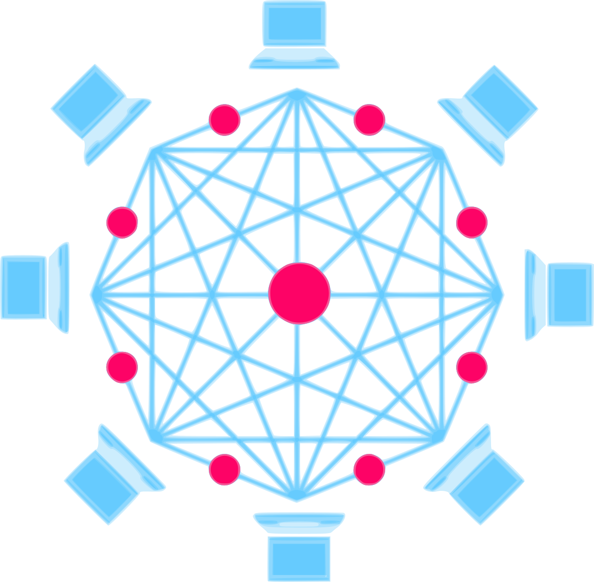
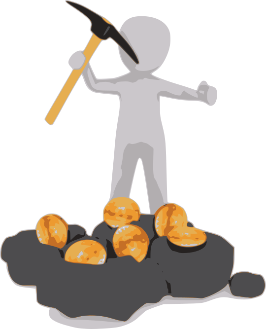

<!-- $theme: gaia -->
<!-- footer: Sobtec 2018 -->
<!-- page_number: true -->
<!-- $size: 4:3 -->
<!-- template: invert -->

# 

## Desmitificant BlockChain

==Abel - <vdo@greyfaze.net> PGP:4EE1184B ==
==Pau - <p4u@dabax.net> PGP:5CF989CD ==

---

# 1. Context històric
---

## Història
* **Cypherpunk** (finals dels 80)
* Criptografia **asimétrica**
(Phil Zimmermann, PGP, 1991)
* **Proof of Work** d'Adam Back (e-mail)
* Xarxes **p2p** (e-Donkey, DHT, Torrent, etc...)
* Nick Szabo, Hal Finney, Dai Wei, etc.
* Satoshi Nakamoto (**Blockchain**)

---

 _... We the Cypherpunks are dedicated to building anonymous systems. We are defending our privacy with cryptography, with anonymous mail forwarding systems, with digital signatures, and with electronic money._ 

Eric Hughes - Cypherpunk manifesto, 1993

---

# (Portada Times)
->> The Times 03/Jan/2009 Chancellor on brink of second bailout for banks.

---

# 2. Blockchain

---

## BlockChain (definició)

* Base de dades distribuïda
* Ordenada i inmutable
* Verificada mitjançant criptografia
* Velocitat de creixement control·lada i estipulada

---

## Blockchain [blocs i miners]

* Informació classificada en _blocs_
* Només els _miners_ poden crear blocs
* BitCoin: 1 bloc = 1 MByte (max)

---

## Blockchain [creixement]

* creixement control·lat amb problema matemàtic
* dificultat proporcional al poder de còmput global
* cada N blocs es recalcula la dificultat
* BitCoin: _1 bloc cada 10 Minuts_

---

### Dificultat i hashrate ultims 9 mesos

---

## Blockchain [recompensa]
* per incentivar la mineria hi ha una **recompensa**
* en el BitCoin inicialment 50 BTC
* cada 4 anys es redueix a la meitat (210k blocs)

---
## Blockchain [diagrama]
<!-- template: -->

---
<!-- template: invert-->
## Blockchain [rel.levancia]

* **base de dades disitribuïda** on els actors no necessiten ser de confiança
* **registre inmutable** i ordenat de dades amb marca de temps (timestamp)
* Dissenyada per a evitar centralització i/o censura.

**Exemples:** Sistema monetari, notaria, vot electrònic, Crowdfundings, etc...

_A més  a més plataformes com Ethereum permeten l'execució de programes en el blockchain._

---

# 3. Desmitificant BitCoin

---

## Bitcoin i Capitalisme

* el sistema es basa en un creixement infinit
>Satoshi és respatlla amb la llei de Moore per justificar la seva escalabilitat
* fomenta i depèn en la competència
>Els miners han de competir entre ells per generar nous blocs d'informació. Qui més recursos té, més en guanya.
* fomenta les "grans empreses" de miners per reduïr la variança i assegurar la recompensa

---
## Ús i abús de la blockchain

* Nova 'criptoeconomia' no regulada i volàtil.
* Especulació i (re)valorització independent de la seva utilitat real
* Hiper-tokenització.
* Nous incentius per a infectar màquines i aprofitar-ne els recursos per a minar.

---

## L'estafa dels darrers anys
1. Shitty Coins (2013)
Treure noves crypto-monedes (normalment copiant altres) i esperar el _pump&sell_
2. ICO (2016)
Crowdfundings amb recompensa. Casos on l'inversió és multiplica per x1000. ¿Model startup?
3. Hard Forks (2017)
Divisions de la cadena amb un altre nóm. A tothom se li dupliquen les unitats de moneda. Generem valor sense fonament!
4. What's next?

---

## Exemples recents

- Veneçuela, Iran, Canon, Nostrum, Facebook, Telegram...
---
titular Ice Tea

---
Cryptokitties?

---
## Privacitat

- Bitcoin i la majoria de blockchains son pseudónimes i totalment _transparents._
* Permeten l'anàlisi i traçabilitat per part d'Estats, empreses privades, agéncies com l'FBI, etc.
---
## Consum d'energia
- Dades 2017
- Comparativa amb països

---
## Consum d'energia

- Canvi de Proof-of-Work a Proof-of-Stake (?)
	- Seguretat no probada.
	- Incentiva l'acumulació de capital.
	
    
- No hi ha una sol.lució segura, probada i energéticament sostenible hores d'ara.
---
## Preguntes i debat