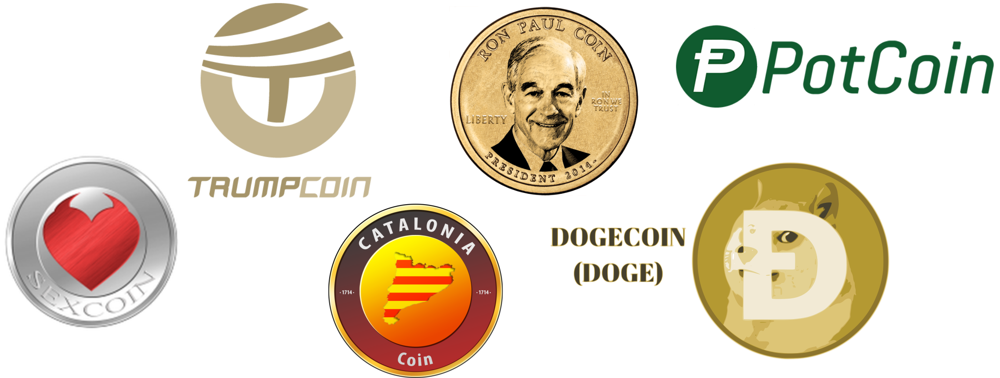
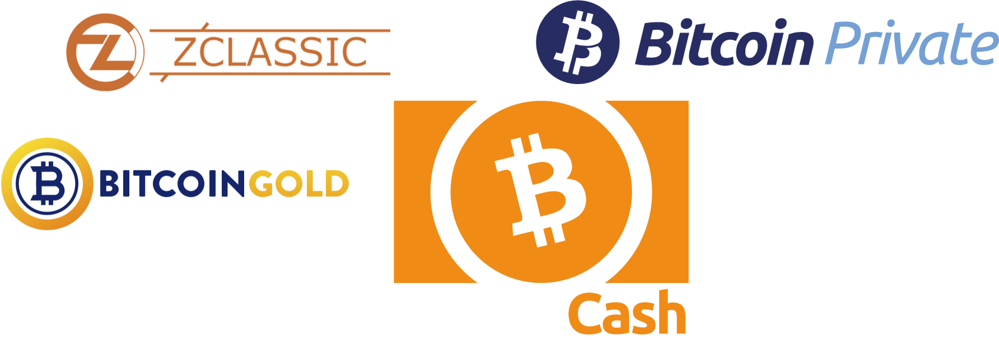
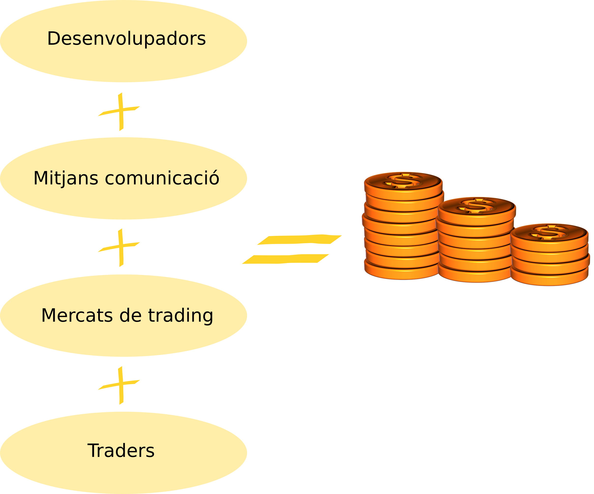
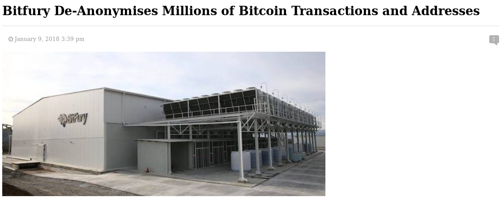

<!-- $theme: gaia -->
<!-- footer: Sobtec 2018 -->
<!-- page_number: true -->
<!-- $size: 4:3 -->
<!-- template: invert -->

# 

## Blockchain: Un univers contradictori

==Abel - <vdo@greyfaze.net> PGP:4EE1184B ==
==Pau - <p4u@dabax.net> PGP:5CF989CD ==

---

# 1. Context històric
---

## Història
* **Cypherpunk** (finals dels 80)
* Criptografia **asimétrica**
(Phil Zimmermann, PGP, 1991)
* **Proof of Work** d'Adam Back (e-mail)
* Xarxes **p2p** (e-Donkey, DHT, Torrent, etc...)
* Nick Szabo, Hal Finney, Dai Wei, etc.
* Satoshi Nakamoto (**Blockchain**)

---

 _... We the Cypherpunks are dedicated to building anonymous systems. We are defending our privacy with cryptography, with anonymous mail forwarding systems, with digital signatures, and with electronic money._ 

Eric Hughes - Cypherpunk manifesto, 1993

---

# The Times 03/Jan/2009

---

# 2. Blockchain

---

## Blockchain [definició]

* Base de dades distribuïda
* Ordenada i inmutable (hashing)
* Verificada mitjançant criptografia
* Velocitat de creixement control·lada i estipulada

---

## Blockchain [blocs i miners]

* Informació classificada en _blocs_
* Només els _miners_ poden crear blocs
* Bitcoin: 1 bloc = 1 MByte (max)

---

## Blockchain [creixement]

* Creixement control·lat amb problema matemàtic.
* Dificultat proporcional al poder de còmput global.
* Cada N blocs es recalcula la dificultat.
* Bitcoin: 
* 		1 bloc cada 10 Minuts
		reajust cada 2048 blocs (~14 dies)

---

### Dificultat i hashrate: últims 9 mesos

---

## Blockchain [recompensa]
* Per incentivar la mineria hi ha una **recompensa**
* En Bitcoin inicialment 50 BTC. Actualment 12.5
* Cada 4 anys (210k blocs) es redueix a la meitat.

---
## Blockchain [diagrama]
<!-- template: -->

---
<!-- template: invert-->
## Blockchain [rel.levancia]

* **Base de dades disitribuïda** on els actors no necessiten ser de confiança.
* **Registre inmutable** i ordenat de dades amb marca de temps (timestamp).
* Dissenyada per a evitar centralització i/o censura.

**Exemples:** Sistema monetari, notaria, vot electrònic, Crowdfundings, etc...

_A més  a més plataformes com Ethereum permeten l'execució de 'programes' en el blockchain._

---

# 3. Desmitificant Bitcoin

---

## Bitcoin i Capitalisme

* El sistema es basa en un creixement infinit.

Satoshi és respatlla amb la llei de Moore per justificar la seva escalabilitat. ***

* Fomenta la competència i economies d'escala.

Els miners han de competir entre ells per generar nous blocs d'informació. Qui més recursos té, més en guanya.

* Fomenta les "grans empreses" de miners per reduïr la variança i assegurar la recompensa 

---
## Ús i abús de la blockchain

* Nova 'criptoeconomia' no regulada i volàtil.
* Manipulació de mercats constant.
* Especulació i (re)valorització independent de la seva utilitat real.
* Hiper-tokenització.
* Nous incentius per a infectar màquines i aprofitar-ne els recursos per a minar.

---

## L'estafa dels darrers anys (1)

### Scam Coins (2013): _monedes 'brossa'_
Crear noves criptomonedes (normalment copiant altres), fer que entrin en algun mercat (normalment partíceps) i esperar el _pump&sell_

>DogeCoin, PotCoin, TrumpCoin, SexCoin, etc.

---
## L'estafa dels darrers anys (2)

### ICO (2016): _initial coin offering_
* Crowdfundings amb recompensa  ¿Model startup?
* Normalment la ICO reparteix un token o moneda entre els seus inversors.
* Casos on l'inversió és multiplica per x1000.
* Un cop tancada la ICO no hi ha control sobre el projecte per part dels inversors.

Arribat un punt dòna igual l'objectiu del projecte a finançar, només si en algun moment es revaloritzarà.

---

## L'estafa dels darrers anys (3)

### Hard Forks (2017)
* Divisions de la cadena en un punt que generen una nova cadena i per tant una nova moneda.
* A tothom se li dupliquen les unitats de moneda. Generem valor sense fonament!

---

---

## Hiper-tokenització

- El "hype" del terme Blockchain atreu a inversors i especuladors. Qualsevol idea, per absurda que sigui, pot aconseguir fons monetaris.
- Veneçuela (Petro), Iran, Canon, Nostrum, Facebook, Telegram...

---
## Privacitat

- Bitcoin i la majoria de blockchains no són anònimes, mes aviat totalment _transparents._
* Permeten l'anàlisi i traçabilitat per part d'Estats, empreses privades, agéncies com l'FBI, etc.

---

---
## Consum d'energia (2017)
- 18.4 TWh / any. (aprox)
- Consum anual comparable a Islàndia.
- A aquest ritme, consum del 100% el 2020 (?)

---
## Alternatives al consum d'energia?

- Canvi de Proof-of-Work a Proof-of-Stake (?)
	- Seguretat no probada.
	- Incentiva l'acumulació de capital en els validadors.
- Proof of Authority i Proof of Cooperation
	- Recentralitzen la descentralització.
	- Requereixen confiança.
	
No hi ha una sol.lució segura, probada i energéticament sostenible a hores d'ara.

--- 
## Conclusions
El potencial ambivalent d'una tecnologia disruptiva:

* Alliberament dels bancs i els estats, o perpetuament de desigualtats económiques?
* Llibertat individual vs models col.lectius en Blockchain (?)
* Contrast amb IA

---
## Satoshi

>Banks must be trusted to hold our money and transfer it electronically, but they lend it out in waves of credit bubbles with barely a fraction in reserve. We have to trust them with our privacy, trust them not to let identity thieves drain our accounts.

>Yes, [we will not find a solution to political problems in cryptography,] but we can win a major battle in the arms race and gain a new territory of freedom for several years.

---
## Preguntes i debat
